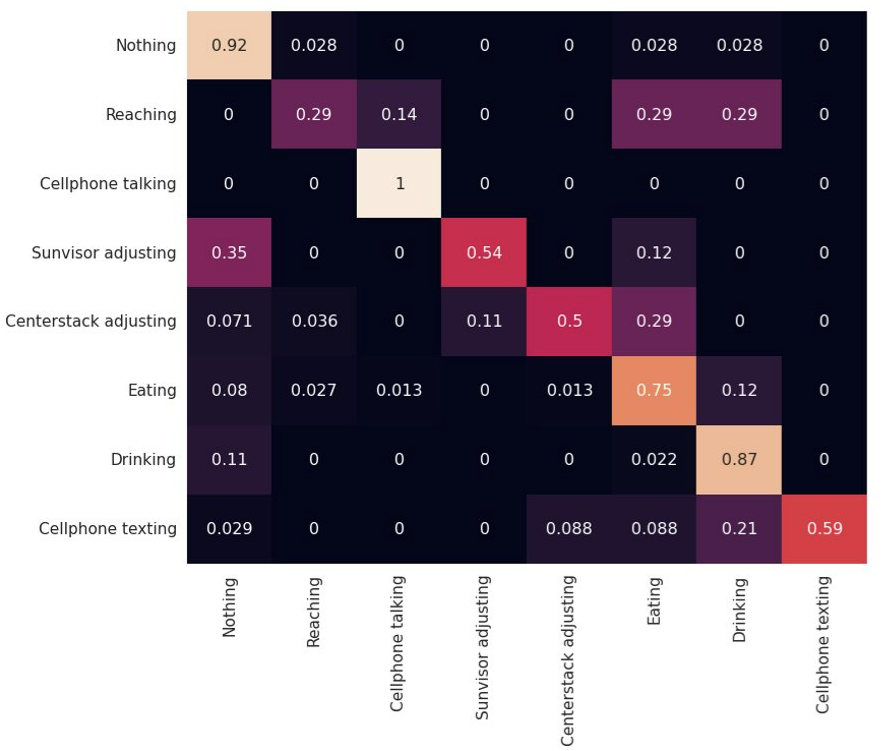
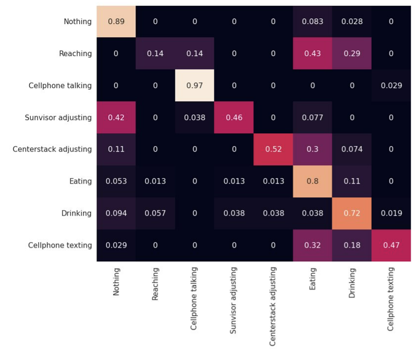
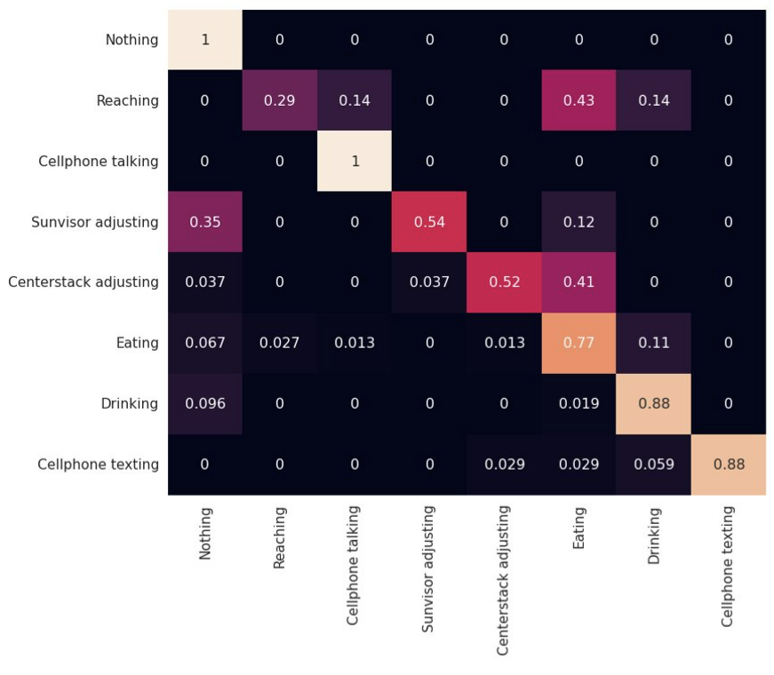

# General overview

MMAction2 is an open-source toolbox for video understanding based on PyTorch. It is a part of the OpenMMLab project. In this repo we provide a working Dockerfile, and python scripts to process videos for action recognition using the the Action Recognition Models, and the Spatio Temporal Action Detection Models. We have performed experiments on 2 datasets- PoseML (RGB videos of drivers) and SHRP2 (Low-quality videos of drivers)

The files required to test an mmaction2 model are : checkpoint(s) (`.pth`), config_file (`.py`) and classes_file(`.txt`).

For details about the method and quantitative results please check the MMAction2 documentation at https://mmaction2.readthedocs.io/en/latest/

## How to test

### Use pre-built docker image

Sign in to the Container registry service at `ghcr.io`

`docker pull ghcr.io/akashsonth/action-recognition:latest`

`docker run -it --rm --runtime=nvidia -v {{dataPath}}:/data action-recognition /bin/bash`

### Build from scratch

NOTE: this has been tested on a Ubuntu 18.04.6 machine, with a Tesla V100-SXM2-16GB GPU, with docker, nvidia-docker installed, and all relevant drivers.

We use in Dockerfile nvidia/cuda:11.3.0-cudnn8-devel-ubuntu20.04 as base image and recommend using the same.

`git clone https://github.com/VTTI/driver-secondary-action-recognition.git`

`cd driver-secondary-action-recognition`

`docker build . -t action-recognition`
 
`docker run -it --rm --runtime=nvidia -v {{dataPath}}:/data action-recognition /bin/bash`

( replace {{dataPath}} with the local folder on your computer containing [input folder] and where the outuput is expected to be stored)

In the file `poseml_long_video.yaml`, replace the value of the parameters- `configFile`, `checkpoint`, and `label` with the required model parameters. We provide 3 trained models, and have provided instructions for them below. You can also make use of the different options from https://mmaction2.readthedocs.io/en/latest/recognition_models.html

`python demo_long_video.py --input INPUT_VIDEO_PATH -- config poseml_long_video.yaml  --output OUTPUT_VIDEO_PATH`

Ex: 
`python demo_long_video.py --input ./sample/input/input.mp4 --config poseml_long_video.yaml --device cuda:0 --output ./sample/output/long_video.mp4`

The initial few frames are required for instantiating the model, and there are no predictions till then.

| frame_no | detection | label | confidence | x_min | y_min | x_max | y_max |
| :-------------: |:-----:|:-----:|:-----:|:-----:|:-----:|:-----:|:-----:|
| 40 | 0 |  texting | 0.56 | | | | |
| 40 | 1 |  driving car | 0.23 | | | | |
| 40 | 1 |  changing oil | 0.07 | | | | |
| . | . | . | . | | | | |
| . | . | . | . | | | | |


Currently this repo supports three Action Recognition Models-

### [TSN](https://mmaction2.readthedocs.io/en/latest/recognition_models.html#tsn)
This is the MMAction2 implementation of [Temporal segment networks: Towards good practices for deep action recognition](https://link.springer.com/chapter/10.1007/978-3-319-46484-8_2)

Value of `CONFIG_FILE` for this case is `configs/recognition/tsn/tsn_r50_1x1x3_100e_kinetics400_rgb.py`

Download the checkpoint from https://mirror.vtti.vt.edu/vtti/ctbs/action_recognition/tsn_r50_1x1x3_100e_kinetics400_rgb_20200614-e508be42.pth, and move it `./checkpoints`

<!--
 
 

 
 

 -->

Metrics on PoseML-
Top 1 Accuracy: 76.19%,
Top 3 Accuracy: 88.54%



The weights for the model trained on the PoseML dataset are provided: https://mirror.vtti.vt.edu/vtti/ctbs/action_recognition/tsn_PoseML_epoch20.pth

The weights for the model trained on the SHRP2 dataset are provided: https://mirror.vtti.vt.edu/vtti/ctbs/action_recognition/tanet_SHRP2_epoch10.pth


### [SlowFast](https://mmaction2.readthedocs.io/en/latest/recognition_models.html#slowfast)
This is the MMAction2 implementation of [SlowFast Networks for Video Recognition](https://openaccess.thecvf.com/content_ICCV_2019/html/Feichtenhofer_SlowFast_Networks_for_Video_Recognition_ICCV_2019_paper.html)

Value of `CONFIG_FILE` for this case is `configs/recognition/slowfast/slowfast_r50_4x16x1_256e_kinetics400_rgb.py`

Download the checkpoint from https://mirror.vtti.vt.edu/vtti/ctbs/action_recognition/slowfast_r50_256p_4x16x1_256e_kinetics400_rgb_20200728-145f1097.pth, and move it `./checkpoints`

<!--
 
 

 
 

-->

Metrics on PoseML-
Top 1 Accuracy: 71.48%,
Top 3 Accuracy: 87.97%



The weights for the model trained on the PoseML dataset are provided: https://mirror.vtti.vt.edu/vtti/ctbs/action_recognition/slowfast_PoseML6sec_epoch65.pth

The weights for the model trained on the SHRP2 dataset are provided: https://mirror.vtti.vt.edu/vtti/ctbs/action_recognition/tanet_SHRP2_epoch95.pth


### [TANet](https://mmaction2.readthedocs.io/en/latest/recognition_models.html#tanet)
This is the MMAction2 implementation of [TAM: Temporal Adaptive Module for Video Recognition](https://openaccess.thecvf.com/content/ICCV2021/html/Liu_TAM_Temporal_Adaptive_Module_for_Video_Recognition_ICCV_2021_paper.html)

Value of `CONFIG_FILE` for this case is `configs/recognition/tanet/tanet_r50_dense_1x1x8_100e_kinetics400_rgb.py`

Download the checkpoint from https://mirror.vtti.vt.edu/vtti/ctbs/action_recognition/tanet_r50_dense_1x1x8_100e_kinetics400_rgb_20210219-032c8e94.pth, and move it `./checkpoints`

<!--
 
 

 
 

-->

Metrics on PoseML-
Top 1 Accuracy: 80.41%,
Top 3 Accuracy: 90.72%



The weights for the model trained on the PoseML dataset are provided: https://mirror.vtti.vt.edu/vtti/ctbs/action_recognition/tanet_PoseML6sec_epoch35.pth

The weights for the model trained on the SHRP2 dataset are provided: https://mirror.vtti.vt.edu/vtti/ctbs/action_recognition/tanet_SHRP2_epoch30.pth


## Training one of the MMAction2 models

Firsly, prepare a folder `train` containing all the video files to be used for training. Create an empty text file `train.txt`. In each line of this text file, you wll have the video name, followed by a space, followed by its class index. Perform a similar action for the validation dataset (`val` video directory and `val.txt` text file)
Ex-
```
VID00031_0001.mp4 1
VID00031_0002.mp4 8
VID00031_0003.mp4 8
        .         .
        .         .
```

In the Docker container, execute the command `python train.py CONFIG_FILE`

Make the following changes in the `train.py` file-
- Edit `cfg.model.cls_head.num_classes = 10` to the number of classes in your dataset
- Modify the path `cfg.work_dir` to your required folder where all the model weights will be saved
- Modify the paths of train videos, val videos, and their corresponding text files
